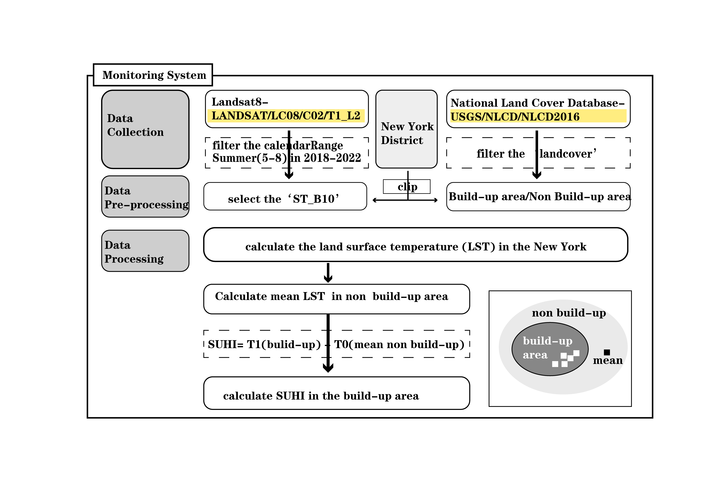
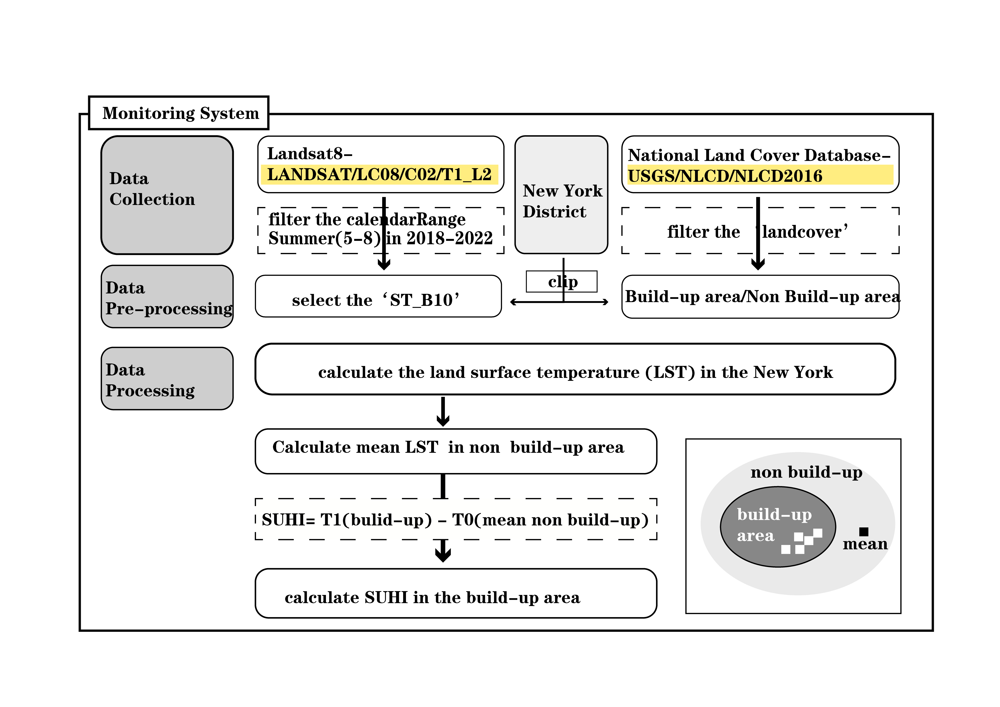
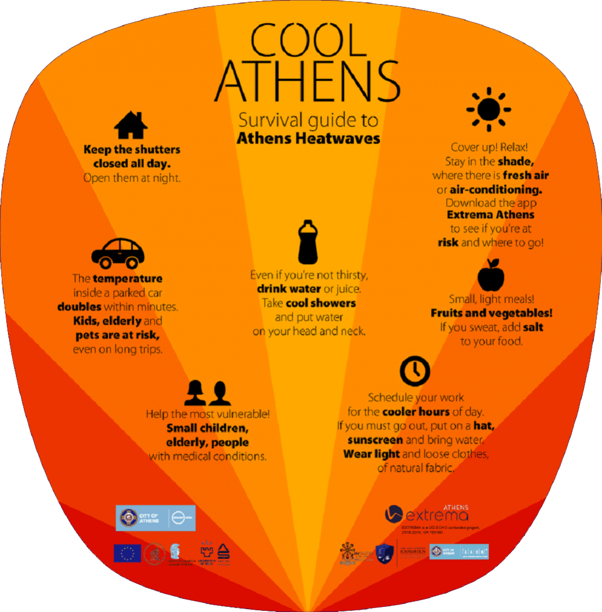

```{r xaringan-themer, include=FALSE, warning=FALSE}
library(xaringanthemer)
style_mono_light(
  base_color = "#23395b",
  header_font_google = google_font("Josefin Sans"),
  text_font_google   = google_font("Montserrat", "300", "300i"),
  code_font_google   = google_font("Fira Mono")
)
```
### 1.1 Learn About Urban Heat Islands

---
### 1.2 Challenges NYC Face


---
### 1.2 Challenges NYC Face


---
### 1.3 Policy overview


---
### 1.4 City examples


---
### 2.1 project approach

**Monitoring System**
```{r echo=FALSE, out.width='100%', fig.align='center', fig.cap= "Monitoring System. Source: [Drawed by Group UPNO.1]"}

```
---
### 2.1 project approach

**Predictinging System**

```{r echo=FALSE, out.width='100%', fig.align='center', fig.cap= "Predictinging System. Source: [Drawed by Group UPNO.1]"}

```
---
### 2.2 Expected output products


---
### 2.3 How to use them
**Government**
+ Help the government to **keep track of the heat island situation**
+ Formulate corresponding policy measures for **different heat levels**
+ Facilitate government departments to **make decisions and formulate regulation measures**

**Public**
.pull-left[
+ The APP provides **timely access to information** related to hot weather warnings, heat prevention and cooling knowledge, medical assistance.
+ The APP can provide **public service functions**, such as checking the nearest places to escape the heat.
+ Residents can interact with each other through the APP, **sharing suggestions on heat prevention**.]
```{r echo=FALSE, out.width='30%', fig.align='right', fig.cap= "Guide to Heatwave"}

```
---
