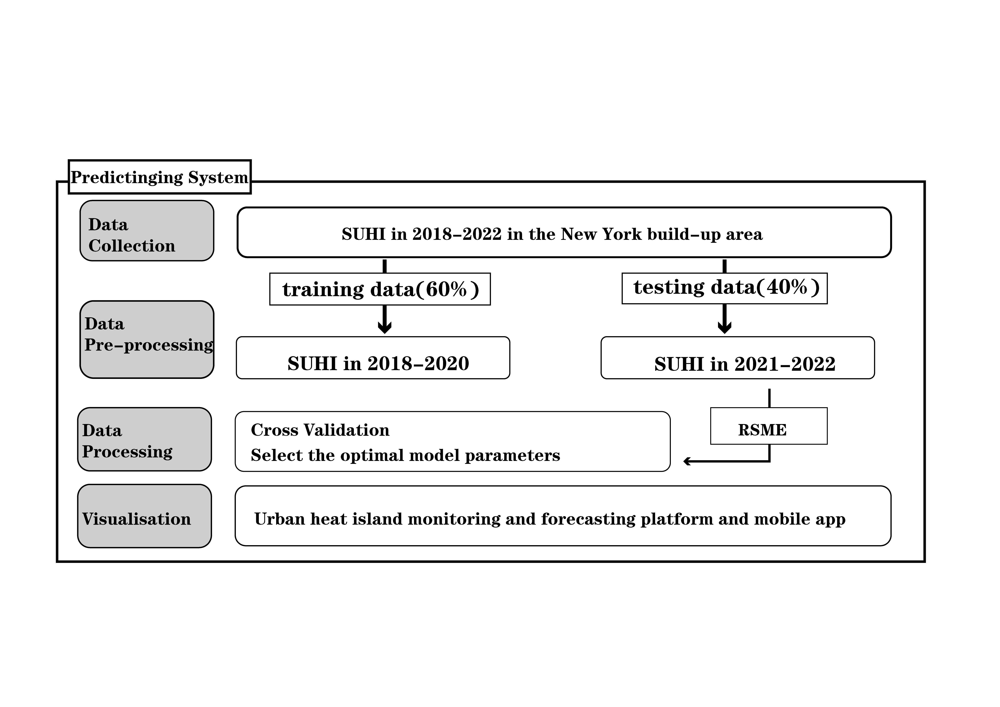
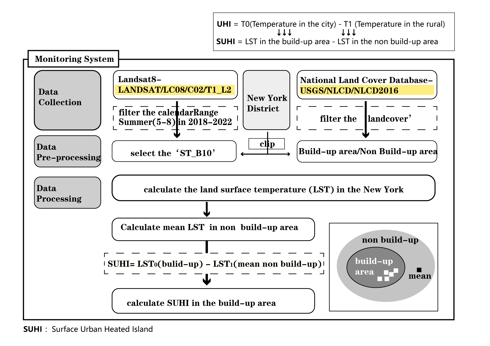
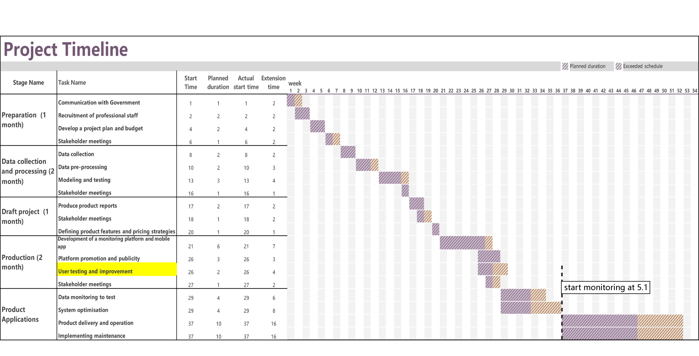

```{r xaringan-themer, include=FALSE, warning=FALSE}
library(xaringanthemer)
style_mono_light(
  base_color = "#23395b",
  header_font_google = google_font("Josefin Sans"),
  text_font_google   = google_font("Montserrat", "300", "300i"),
  code_font_google   = google_font("Fira Mono")
)
```
### 1.1 Learn About Urban Heat Islands 

--

<h3>What are Heat Islands?</h3>

Urban areas, where these structures are highly concentrated and greenery is limited, become “islands” of higher temperatures relative to outlying areas. These pockets of heat are referred to as “heat islands.”

<center><h4><b>Urban Heat Island: City temperatures are often higher than those of nearby rural areas<b/></h4>

        
<center><h6><b>SOURCE:Fuladlu et. all, 2018,Unpacking the Urban Heat Island Effect<b/></h6>

---
### 1.1 Learn About Urban Heat Islands 
<p></p>
<p></p>
<p></p>
<table>
        <td ><left><h3><b>Causes of UHI effect<b/></h3><left/>
<ul style="list-style-type:disc;">
  <li>Reduced Natural Landscapes in Urban Areas</li>
  <li>Urban Material Properties</li>
  <li>Urban Geometry</li>
  <li>Heat Generated from Human Activities</li>
  <li>Weather and Geography</li>
</ul></td>
        <td> 
        <center>
        <center><h6><b>SOURCE:D.S.Lemmen and F.J.Warren,Climate change impacts and Adaptation<b/></h6></center></td>
</table>

---
### 1.2 Challenges NYC Face   
<table>
        <td >The New York City Panel on Climate Change (NPCC) projects up to a 5.7°F increase in New York City (NYC) average temperatures and a doubling of the number of days above 90°F by the 2050s.</left></td>
        <td ><left>New York City faces many social, environmental, economic and infrastructural risks due to the heat island effect.</left>
    <tr>
        <td><center><center/>
        <font size='1'>Figure:Temperatures in the Contiguous 48 States, 1901–2021.Data source:  NOAA, 2022. 
</font></td>
        <td ><center><font size='1'>Figure:NYC Thermal Imagery. Data source: LANDSAT Thermal Data, 2009.</font>
</center> </td>
    </tr>
</table>
---
### 1.2 Challenges NYC Face

--

<h3>Social impacts</h3>
Heat is the NO.1 weather-related killer in the US (NOAA, 2016). Every year, NYC experiences an average of 450 heat-related emergency department visits, 150 heat-related hospital admissions, and 13 heat-stroke deaths. The City also averages about 115 excess deaths from natural causes exacerbated by extreme heat annually (Matte et. all, 2016).

<center><p><br>
        
<center><h6><b>Source: NOAA National Weather Service, 2016.<b/></h6>

---
### 1.2 Challenges NYC Face
<table>
        <td ><font size='5'><b>Economic Impacts<b/></font>
<p><font size='4'>Affecting  workforce productivity, retail sales, tourism, and the competitiveness of regions.</font><br></td>
        <td ><font size='5'><b>Environmental Impacts<b/></font>
<p><font size='4'>Impacts on landscapes and urban ecology.</font><br>
    <tr>
        <td><font size='5'><b>Infrastructure Impacts<b/></font>
<p><font size='4'>Impacts on built infrastructure systems  include water, energy, and transportation systems.</font><br></td>
        <td ><font size='5'><b>Sustainability and Resilience Impacts<b/></font>
<p><font size='4'>More difficult to achieve sustainability and resilience planning goals.</font> <br></td>
    </tr>
</table>

<center><p><br>
        
<center><h6><b>Source: Planning for Urban Heat Resilience ,2022<b/></h6>

 

---
### 1.2 Challenges NYC Face

<center>
<p><br>
        
<center><h6><b>Source: NOAA National Weather Service, 2016.<b/></h6>
---

### 1.3 Policy overview
## International policys

**[United Nations New Urban Agenda (2015)🔗](https://habitat3.org/the-new-urban-agenda/)**
- Point 54 :**Reducing** the … air pollution, **urban heat island effects** and noise.

**[Universal Sustainable Development Goals (2015)🔗](https://www.undp.org/sustainable-development-goals), [SDG 11 Issue Brief (2018)🔗](https://wedocs-unep-org.translate.goog/handle/20.500.11822/25763?_x_tr_sl=en&_x_tr_tl=zh-CN&_x_tr_hl=zh-CN&_x_tr_pto=sc)**
- Goal 11: Make cities and human settlements **inclusive, safe, resilient and sustainable**.
- Cleaner,greener cities: Investing in parks and green spaces in urban areas will help to **amelioratethe urban heat island effect** and improve air quality in urban spaces.

**[Sendai Framework for Disaster Risk Reduction 2015-2030 (2015)🔗](https://www.undrr.org/publication/sendai-framework-disaster-risk-reduction-2015-2030)**
- Expected outcome: The substantial **reduction of disaster risk and losses in lives, livelihoods and health**.
- Target 7 : Substantially increase the **availability of and access to multi-hazard early warning systems and disaster risk information and assessments to people** by 2030.

```{r xaringan-tile-view, echo=FALSE}
xaringanExtra::use_tile_view()
```


???
- In view of the social, economic and environmental damage caused by the urban heat island effect.
- International policies in recent years have begun to focus on the **reducing the heat island effect and establishing a warning system**.


---
### 1.3 Policy overview

### New York policys

**[OneNYC 2050 Volume 7 (2019)🔗](https://onenyc.cityofnewyork.us/strategies/a-livable-climate/)**
- Goal: **A LIVABLE CLIMATE.**
- INITIATIVE 21: New York City is making changes to its physical environment to promote resiliency ...... Such as wetland and forest restoration, to stabilize shorelines, reduce erosion, act as carbon sinks, and **mitigate urban heat island effects**.

**[Securing Our Future: Strategies for New York City in the Fight Against Climate Change (2020)🔗](https://council.nyc.gov/data/securing-our-future/)**
- Goal: **Achieve cooling equity and reduce heat-related deaths.**
- Key strategy: **Increase cooling assistance for vulnerable populations**.

**[Cool Neighborhoods NYC (2017)🔗](https://www.preventionweb.net/publication/cool-neighborhoods-nyc-comprehensive-approach-keep-communities-safe-extreme-heat)**
- Cool Neighborhoods NYC **Monitoring Strategies: Collecting Innovative Data** to Deliver Inclusive and Health-focused Climate Policy.

???
- In response to these internationalp policies,
- New York has developed **a number of strategies and tactics** to reduce the heat island effect and Fight Against Climate Change.p- **Like increasing shade, greenery cover. Addressing challenges through data collection and monitoring system.**

  
  
---
### 1.4 City examples
#### Warning services: App and Dashboard 

**[EXTREMA project🔗](https://extrema.space/)** <br/>
A dynamic platform of solutions that Cities are co-creating. Athens, Paris, Rotterdam, Milan and Lisbon have endorsed EXTREMA services. 

 <br/>
Source: [EXTREMA | Global🔗](https://extrema-global.com/)


???
#### What is EXTREMA project?
- A dynamic platform of solutions that Cities are co-creating - Free to residents and visitors of participating cities. 
#### What the Mobile app provides the public？
- Evaluating the real-time personalised health risk of the user at his/her location.
- Alerts, recommendations and routing instructions to the nearest cooling centres.
#### What the Dashboard provides the local authorities？
- Next day alerts.
- Current hazard maps.
- Information management tool for the cooling centres.
#### Which cities have endorsed EXTREMA services
- Athens, Paris, Rotterdam, Milan, Lisbon and the Island of Mallorca.
---
### 1.5 International approach examples

#### Assessment of the UHI effect

The most common assessment of the SUHI uses satellite platforms to measure the **land surface temperature (LST)** (Bechtel et al.,2019).

.panelset[

.panel[.panel-name[UK]
- **City**: London

- **Data**: A five-year (2016-2020) time series of satellite-derived 100 m daytime LST images.

- **Approach**: After estimating the 2016-2020, average, summertime, daytime LST is to aggregate them to city block level. In addition to the average LST (avgLST), the avgLST standard deviation, minimum and maximum for each city block are also estimated.

- **Source**: Major Summer Heat Spots using Landsat-8 Thermal Satellite data.
]


.panel[.panel-name[India]
- **City**: Jaipur

- **Data**: Moderate Resolution Imaging Spectroradiometer (MODIS) data.

- **Approach**: Analysis of land surface temperature (LST) data shows that significant SUHI growth exists over the study area.

- **Source**: Investigating spatio-temporal surface urban heat island growth over Jaipur city using geospatial techniques.

]


.panel[.panel-name[Morocco]
- **City**: Casablanca

- **Data**: A time series of Landsat TM/ETM+/OLI-TIRS images and nocturnal MODIS images.

- **Approach**: In order to better analyze intense heat produced by urban core, SUHI intensity (SUHII) was computed by quantifying the difference of land surface temperature (LST) between urban and rural areas.

- **Source**: Effects of Urbanization and Seasonal Cycle on the Surface Urban Heat Island Patterns in the Coastal Growing Cities: A Case Study of Casablanca, Morocco.

]

.panel[.panel-name[China]
- **City**: Shijiazhuang

- **Data**: Landsat TM images on the mesoscale level and airborne hyperspectral thermal images on the microscale level.

- **Approach**: Land surface temperature (LST) was retrieved from four scenes of Landsat TM data in the summer days to analyze the thermal spatial patterns and intensity of surface UHI (SUHI).

- **Source**: Analysis of the Urban Heat Island Effect in Shijiazhuang, China Using Satellite and Airborne Data.

]


]

???
- The most common assessment of the SUHI uses satellite platforms to measure the land surface temperature (LST).
- satellite data like landsat8 provides can be used for **mapping the spatial distribution of urban surface temperatures and identifying urban hotspots.**
---
### 2.1 Project approach

**Monitoring System**
```{r echo=FALSE, out.width='100%', fig.align='center', fig.cap= "Monitoring System. Source: [Drawed by Group UPNO.1]"}

```
---
### 2.1 Project approach

**Predictinging System**

```{r echo=FALSE, out.width='100%',fig.align='center', fig.cap= "Predictinging System. Source: [Drawed by Group UPNO.1]"}

```
---
### 2.2 Expected output products
.pull-left[
  
#### UHI monitoring, early warning website
- The website is able to visualise the distribution of urban heat islands.
- It can issue timely hot weather warning information.
- It can summarise and collect data on urban heat islands.

#### App for residents
- Disseminate timely information on hot weather warnings to users through push and information alerts.
- It can display the distribution of urban heat islands through map technology and provide information about heat islands.
- Provides information and advice on coping with hot weather to help users prepare for it.
]

.pull-right[
```{r echo=FALSE, out.width='80%'}

```
<small> Fig.1.Website showing heat island distribution. Source: [Yujin](https://code.earthengine.google.com/28e648405cc7a843996deb56d1c35413)
</small>

```{r echo=FALSE, out.width='80%'}

```
<small>Fig.1.The APP for residents. Source: [Urban Canopy](https://urbancanopy.io/earthhacks)
] 
</small>
---

### 2.3 How to use them
**Government**
+ Help the government to **keep track of the heat island situation**
+ Formulate corresponding policy measures for **different heat levels**
+ Facilitate government departments to **make decisions and formulate regulation measures**

**Public**
.pull-left[
+ The APP provides **timely access to information** related to hot weather warnings, heat prevention and cooling knowledge, medical assistance.
+ The APP can provide **public service functions**, such as checking the nearest places to escape the heat.
+ Residents can interact with each other through the APP, **sharing suggestions on heat prevention**.]
```{r echo=FALSE, out.width='30%', fig.align='right', fig.cap= "Guide to Heatwave"}

```

---

### 2.4 Why the products are useful

#### Their usefulness
- Helping the government better monitor urban heat island conditions.
- Provide timely warnings and take countermeasures to reduce the impact of hot weather.
- Reduce casualties and damage caused by hot weather.
- Support urban planning and management by providing information of urban heat islands.
- Help government decision-makers to formulate urban planning and management policies better.

#### Innovations
- Display data and information on urban heat islands through visualisation.
- Instant communication.
- Make intelligent predictions and warnings through artificial intelligence technology.
- Extensibility of platform functionality.

---

### 3.1 Possible risks and strtegies

#### The influence of local features such as building density and height on the accuracy of detection and prediction 
In addition to remote sensing data, real-time temperature detection devices are deployed in urban spaces to improve data accuracy.  
#### The accuracy of the warning information to the public and conflicts with the existing government notification system.
When communicating thermal risks, it is essential to streamline the language, clarify the distinction between different warning levels, and ensure the accuracy of the information. 
#### Websites and apps have high operating costs in the later stages and may exceed the budget.
Establishing a sound budget and resource management mechanism, including budget planning, resource allocation, cost control and other aspects, is necessary. At the same time, effective monitoring mechanisms must ensure that budgets and resources are used wisely.

---
### 3.2 Project management


```{r echo=FALSE, out.width='100%', fig.align='center'}

```

---
### 3.3 Project Funds Costs Plan

**Costs**
```{r echo=FALSE, out.width='100%'}
xaringanExtra::use_panelset()

cost<- read.csv("cost.csv", 
                         header = TRUE, 
                         sep = ",",  
                         encoding = "latin1")
```

.panelset[

.panel[.panel-name[Direct Costs]

```{r echo=FALSE, out.width='100%'}
Direct<-cost[2:5,]

knitr::kable(head(Direct), format = 'html')
```
]
.panel[.panel-name[Indirect Costs]
```{r echo=FALSE, out.width='100%'}
equip<-cost[7:10,]

knitr::kable(head(equip), format = 'html')
```

]
.panel[.panel-name[Total Costs]
```{r echo=FALSE, out.width='100%'}
other<-cost[11,c(2,3)]

knitr::kable(head(other), format = 'html')
```

]
]

---
### 4 Summary
- UHI is identified using highly accurate remote sensing data. 

- Try to build a digital information platform to achieve common urban thermal data.

- Build an app on the residential side to realise the communication of people's livelihood data. 

- Future expectations: Based on websites and the app, more people's livelihood projects in the city will be carried out. 

- Disadvantages: The accuracy and frequency of updating urban thermal data need further optimisation.

---
### References
